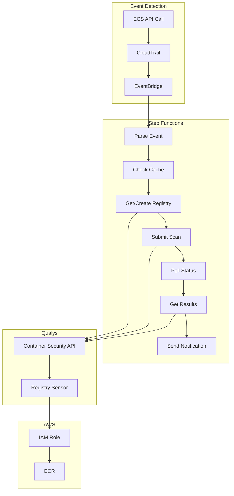
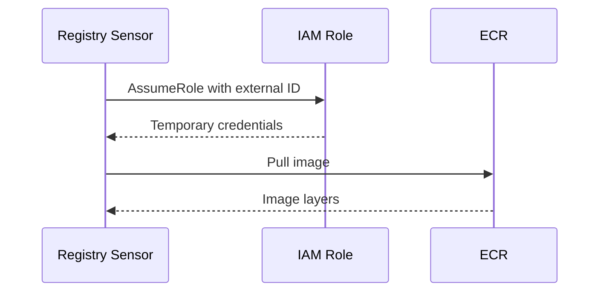
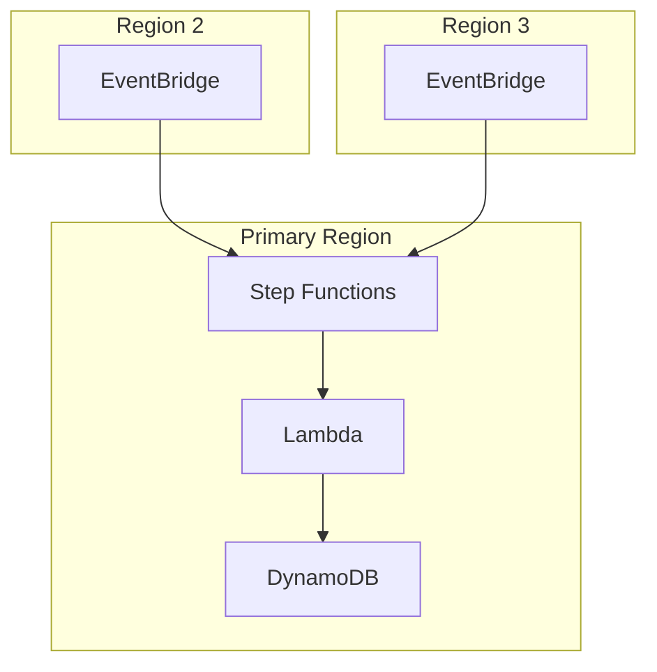
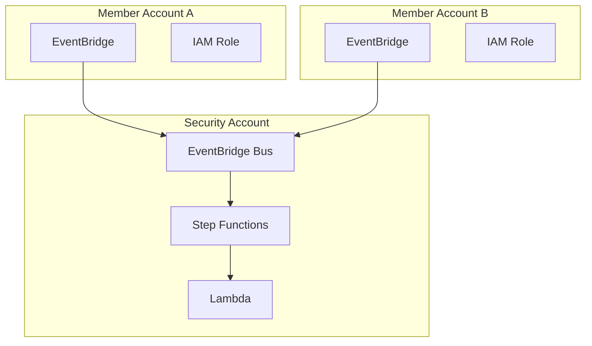
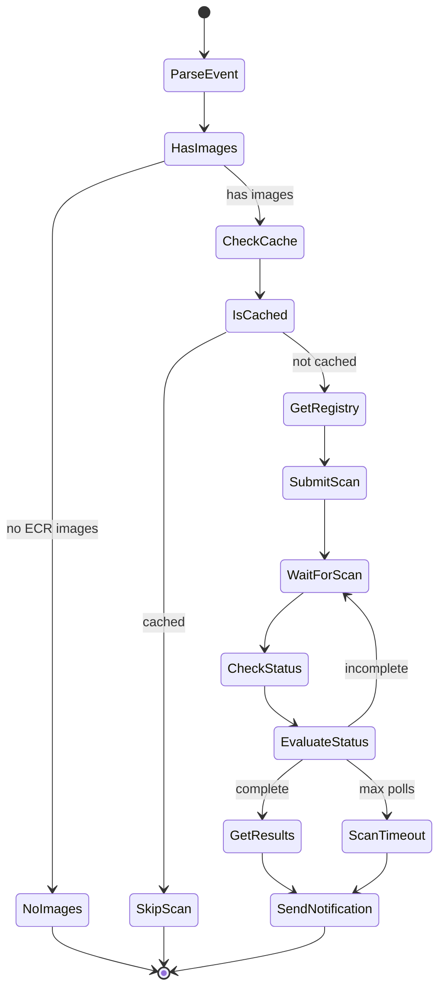

# Event-Driven Container Scanning for AWS Fargate

This document describes an event-driven architecture for triggering Qualys vulnerability scans when Fargate tasks are deployed. The solution uses Step Functions for workflow orchestration and IAM roles for ECR access.

## Architecture



ECS API calls are logged by CloudTrail and matched by EventBridge rules. EventBridge triggers a Step Functions workflow that extracts ECR images from the event, checks a DynamoDB cache, and calls the Qualys API to submit scans. The Qualys Registry Sensor assumes an IAM role to pull images from ECR.

## IAM Role Configuration

The Qualys Registry Sensor requires an IAM role to access ECR. The role can be created during deployment or provided as an existing role.

### Requirements

**Trust Policy:**
```json
{
  "Version": "2012-10-17",
  "Statement": [
    {
      "Effect": "Allow",
      "Principal": {
        "AWS": "arn:aws:iam::QUALYS_ACCOUNT_ID:root"
      },
      "Action": "sts:AssumeRole",
      "Condition": {
        "StringEquals": {
          "sts:ExternalId": "QUALYS_EXTERNAL_ID"
        }
      }
    }
  ]
}
```

**Permissions:**
- `AmazonEC2ContainerRegistryReadOnly` managed policy

Retrieve the Qualys account ID and external ID:
```bash
curl -s "https://gateway.qg2.apps.qualys.com/csapi/v1.3/registry/aws-base" \
  -H "Authorization: Bearer $TOKEN" | jq
```

### Authentication Flow



## Deployment

### Single Account

```bash
# Using existing role
make deploy QUALYS_POD=US2 EXISTING_ROLE_ARN=arn:aws:iam::123456789012:role/qualys-role

# Creating new role
make deploy QUALYS_POD=US2 CREATE_ROLE=true
```

### Multi-Region

Regional spokes forward events to the primary region:



```bash
make deploy QUALYS_POD=US2 AWS_REGION=us-east-1 EXISTING_ROLE_ARN=...
make deploy-region REGION=us-west-2,eu-west-1
```

### Multi-Account

Hub-spoke pattern for AWS Organizations:



```bash
# Hub
make deploy-hub QUALYS_POD=US2 OrganizationId=o-xxx EXISTING_ROLE_NAME=qualys-role

# Spokes
make deploy-spoke-stackset \
  OrganizationId=o-xxx \
  OrgUnitIds=ou-xxx \
  SecurityAccountId=111111111111 \
  CentralEventBusArn=arn:aws:events:... \
  EXISTING_ROLE_NAME=qualys-role
```

## Event Detection

CloudTrail captures ECS management events:

```yaml
EventSelectors:
  - ReadWriteType: WriteOnly
    IncludeManagementEvents: true
```

EventBridge matches the following events:

| Event | Description |
|-------|-------------|
| `RegisterTaskDefinition` | New task definition revision |
| `RunTask` | Standalone task launched |
| `CreateService` | New service created |
| `UpdateService` | Service deployment updated |

## Workflow



### Parse Event

Extracts ECR image URIs from task definition containers:

```python
ECR_IMAGE_PATTERN = re.compile(
    r'^(\d+)\.dkr\.ecr\.([a-z0-9-]+)\.amazonaws\.com/([^:@]+)(?::([^@]+))?(?:@(sha256:[a-f0-9]+))?$'
)

def parse_ecr_image(image_uri):
    match = ECR_IMAGE_PATTERN.match(image_uri)
    if not match:
        return None
    account, region, repo, tag, digest = match.groups()
    return {
        'account_id': account,
        'region': region,
        'repository': repo,
        'tag': tag or 'latest',
        'digest': digest
    }
```

### Cache

DynamoDB stores scan results with 7-day TTL. Container images are immutable, so the same digest does not require rescanning:

```python
def handle_check_cache(data):
    cache_key = data.get('digest') or f"{data['repository']}:{data['tag']}"
    response = table.get_item(Key={'imageDigest': cache_key})
    if 'Item' in response:
        if response['Item']['ttl'] > int(datetime.now().timestamp()):
            return {**data, 'cached': True}
    return {**data, 'cached': False}
```

### Registry Management

Creates Qualys registry connector if not found:

```python
def get_or_create_registry(creds, registry_name, account_id, region, role_arn):
    registry_uri = f"https://{account_id}.dkr.ecr.{region}.amazonaws.com"
    uuid = get_registry_uuid(creds, registry_uri)
    if uuid:
        return {'registry_uuid': uuid, 'created': False}
    result = create_ecr_registry(creds, registry_name, account_id, region, role_arn)
    return {'registry_uuid': result['registry_uuid'], 'created': True}
```

### Scan Submission

```python
payload = {
    "filters": [{"repoTags": [{"repo": repo_name, "tag": tag_filter}]}],
    "name": f"ECR-{repo_name}-{datetime.now().strftime('%Y%m%d%H%M%S')}",
    "onDemand": True,
    "forceScan": True,
    "registryType": "AWS"
}

response = requests.post(
    f"{gateway_url}/csapi/v1.3/registry/{registry_uuid}/schedule",
    json=payload,
    headers=headers
)
```

### Polling

Step Functions polls every 60 seconds for up to 30 attempts:

```yaml
WaitForScan:
  Type: Wait
  SecondsPath: $.wait_seconds
  Next: CheckStatus

EvaluateStatus:
  Type: Choice
  Choices:
    - Variable: $.scan_complete
      BooleanEquals: true
      Next: GetResults
    - Variable: $.poll_count
      NumericGreaterThanEqualsPath: $.max_polls
      Next: ScanTimeout
  Default: IncrementPoll
```

### Notification

SNS notifications are sent for critical or high severity findings:

```python
def handle_notify(data):
    summary = data.get('scan_result', {}).get('summary', {})
    if summary.get('critical', 0) == 0 and summary.get('high', 0) == 0:
        return {**data, 'notified': False}
    sns.publish(
        TopicArn=SNS_TOPIC_ARN,
        Subject=f"Scan: {repository} - {summary['critical']}C/{summary['high']}H",
        Message=json.dumps(message)
    )
```

## API Reference

| Endpoint | Purpose |
|----------|---------|
| `GET /csapi/v1.3/registry/aws-base` | Get Qualys AWS account ID and external ID |
| `GET /csapi/v1.3/registry` | Find registry by URI or name |
| `POST /csapi/v1.3/registry` | Create ECR registry connector |
| `POST /csapi/v1.3/registry/{uuid}/schedule` | Submit on-demand scan |
| `GET /csapi/v1.3/images/{imageId}` | Check scan status |
| `GET /csapi/v1.3/images/{imageId}/vuln` | Get vulnerability details |

## Prerequisites

1. Qualys Registry Sensor deployed in ECS
2. Qualys API token with Container Security permissions
3. AWS CLI with CloudFormation permissions

## Cost

| Component | Estimate |
|-----------|----------|
| Step Functions | $0.025 / 1000 executions |
| Lambda | $0.20 / 1000 scans |
| DynamoDB | $0.25 / million requests |
| CloudTrail | $0.10 / 100k events |
| Cross-region events | $1.00 / million |

Approximately $15-25/month for 1000 deployments per day.

## Troubleshooting

| Issue | Resolution |
|-------|------------|
| Workflow not triggering | Verify CloudTrail logs ECS events, check EventBridge rules |
| Registry creation failed | Verify IAM role exists and trusts Qualys account |
| Scan timeout | Increase `MaxPollAttempts` parameter |
| API errors (401/403) | Regenerate Qualys token, update Secrets Manager |
