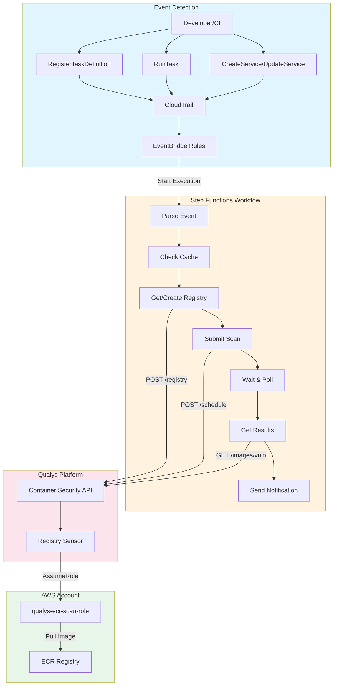
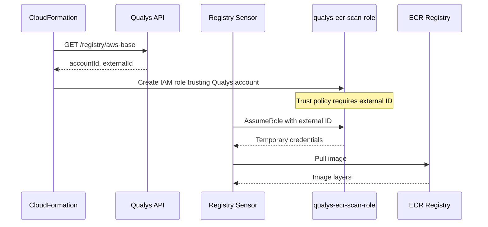
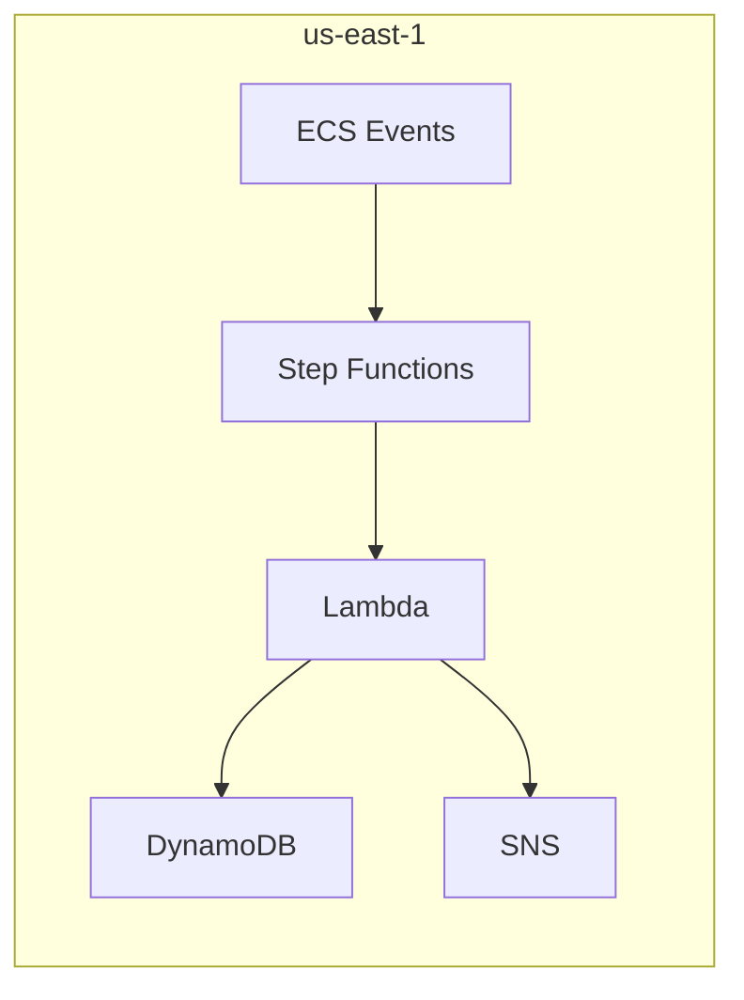
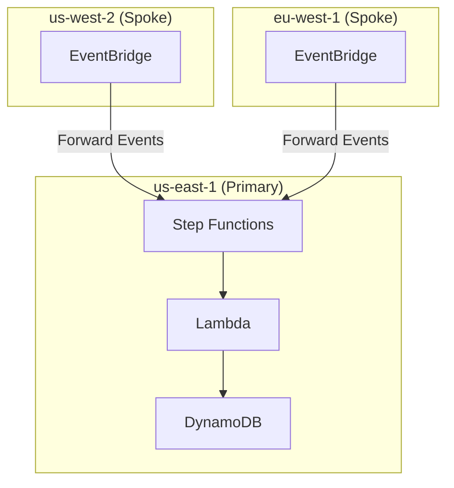
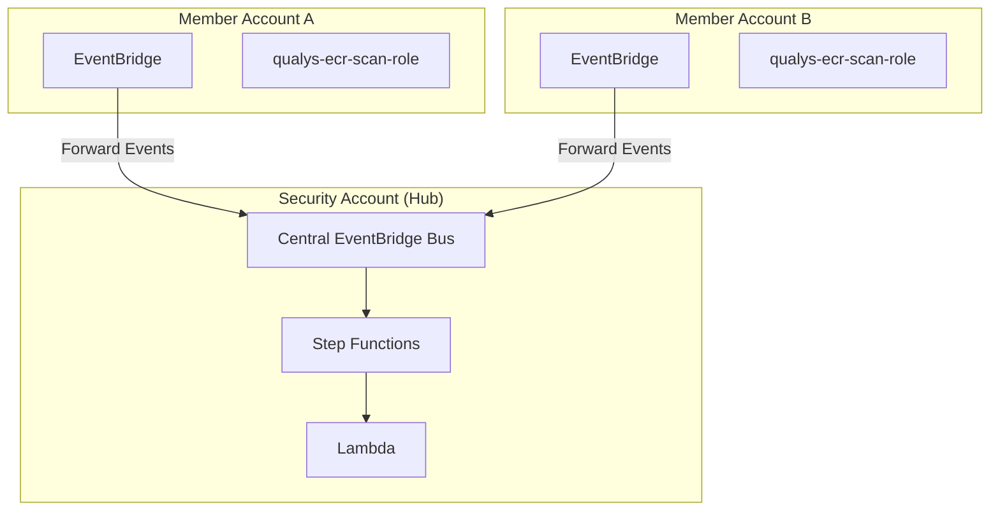
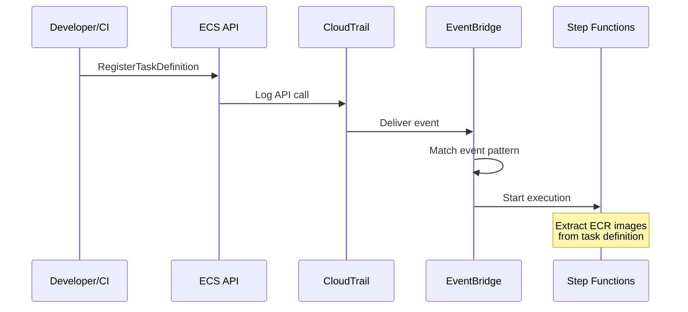
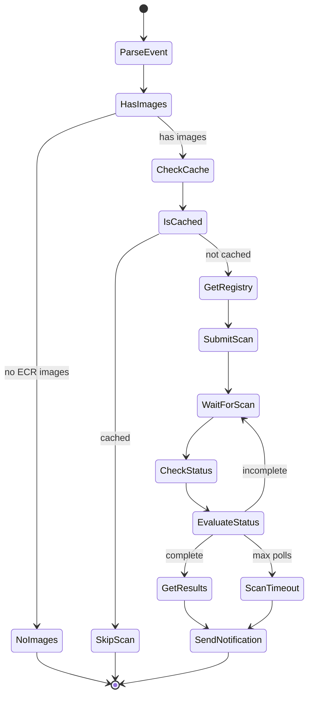

# Event-Driven Container Scanning for AWS Fargate with Qualys

Every container deployed to Fargate is a potential attack surface. Base images ship with unpatched OS packages. Application dependencies carry known CVEs. The window between deployment and vulnerability discovery represents active risk exposure.

This post presents an event-driven architecture that triggers Qualys vulnerability scans automatically when Fargate tasks are deployed. Step Functions orchestrates the workflow with built-in retry logic. IAM roles provide ECR access without static credentials. The architecture scales from single-account deployments to enterprise-wide coverage across AWS Organizations.

## The Container Security Challenge

Traditional container scanning approaches create coverage gaps:

- **Scheduled scans**: Images deployed between scan windows run unanalyzed in production
- **Manual triggers**: Developers forget, skip, or disable scanning to meet deadlines
- **Build-time only**: Base image vulnerabilities discovered post-deployment require re-scanning
- **Static credentials**: ECR access keys require rotation and create secret sprawl

The solution is event-driven scanning with IAM role-based authentication. Every Fargate deployment triggers analysis automatically. No credentials to rotate. No gaps in coverage.

## Architecture Overview



When a developer registers a task definition or deploys a service, CloudTrail logs the ECS API call. EventBridge matches the event and starts a Step Functions workflow. The workflow extracts ECR image references, calls the Qualys Container Security API to submit an on-demand scan, and polls for completion. The Qualys Registry Sensor assumes an IAM role to pull images from ECR—no static credentials required. Critical findings trigger SNS notifications.

## IAM Role-Based Authentication

The architecture uses cross-account IAM role assumption for ECR access:



During deployment, CloudFormation calls the Qualys API to retrieve the base account ID and external ID. It creates an IAM role that trusts the Qualys AWS account, protected by the external ID to prevent confused deputy attacks. When the Registry Sensor needs to pull an image, it assumes this role and receives temporary credentials.

This approach provides several advantages:

- **No credential rotation**: IAM handles credential lifecycle automatically
- **No secrets to store**: External ID is fetched fresh during each deployment
- **Audit trail**: CloudTrail logs all AssumeRole calls
- **Least privilege**: Role has only `AmazonEC2ContainerRegistryReadOnly` permissions

## Deployment Options

The architecture supports three deployment patterns, scaling from single-region to enterprise-wide coverage.

### Single Account, Single Region

The simplest deployment covers one AWS account and region:



```bash
export QUALYS_API_TOKEN="your-bearer-token"
make deploy QUALYS_POD=US2
```

The Makefile automatically fetches the Qualys base account ID and external ID from the API. No manual configuration required.

### Single Account, Multi-Region

For organizations running Fargate across multiple regions, regional spokes forward events to a primary region:



```bash
# Deploy primary stack
make deploy QUALYS_POD=US2 AWS_REGION=us-east-1

# Add regional spokes (comma-separated)
make deploy-region REGION=us-west-2,eu-west-1,ap-southeast-1
```

Regional spokes are lightweight—just EventBridge forwarding rules and an optional CloudTrail. All processing happens in the primary region, keeping costs low. Cross-region event delivery costs approximately $1 per million events.

### Multi-Account (Hub-Spoke)

Enterprise deployments use a hub-spoke pattern with AWS Organizations:



```bash
# Deploy hub in security account
make deploy-hub QUALYS_POD=US2 OrganizationId=o-xxxxxxxxxx

# Deploy spokes via StackSet to all member accounts
make deploy-spoke-stackset \
  OrganizationId=o-xxxxxxxxxx \
  OrgUnitIds=ou-xxxx-xxxxxxxx \
  SecurityAccountId=111111111111 \
  CentralEventBusArn=arn:aws:events:us-east-1:111111111111:event-bus/qualys-fargate-scanner-hub-central-bus
```

Each spoke creates an IAM role for Qualys ECR access and forwards ECS events to the central hub. The hub processes all scans centrally, providing unified visibility across the organization.

## Event Detection

The detection chain transforms ECS API activity into workflow executions:



### CloudTrail Configuration

CloudTrail captures ECS management events with write-only filtering:

```yaml
EventSelectors:
  - ReadWriteType: WriteOnly
    IncludeManagementEvents: true
```

### EventBridge Rules

Three EventBridge rules capture different Fargate deployment patterns:

| Event | When It Fires |
|-------|---------------|
| `RegisterTaskDefinition` | New task definition revision created |
| `RunTask` | Standalone task launched |
| `CreateService` / `UpdateService` | Service created or deployment updated |

Input transformation extracts the task definition ARN and container definitions, passing them to Step Functions.

## Workflow Orchestration

Step Functions provides durable workflow execution with built-in retry logic, state management, and visual debugging.



### Parse Event

The workflow extracts ECR image URIs from task definition containers:

```python
ECR_IMAGE_PATTERN = re.compile(
    r'^(\d+)\.dkr\.ecr\.([a-z0-9-]+)\.amazonaws\.com/([^:@]+)(?::([^@]+))?(?:@(sha256:[a-f0-9]+))?$'
)

def parse_ecr_image(image_uri):
    match = ECR_IMAGE_PATTERN.match(image_uri)
    if not match:
        return None
    account, region, repo, tag, digest = match.groups()
    return {
        'account_id': account,
        'region': region,
        'repository': repo,
        'tag': tag or 'latest',
        'digest': digest
    }
```

### Cache Check

DynamoDB stores recent scan results with 24-hour TTL, preventing redundant scans:

```python
def handle_check_cache(data):
    cache_key = data.get('digest') or f"{data['repository']}:{data['tag']}"
    response = table.get_item(Key={'imageDigest': cache_key})
    if 'Item' in response:
        if response['Item']['ttl'] > int(datetime.now().timestamp()):
            return {**data, 'cached': True}
    return {**data, 'cached': False}
```

### Registry Management

The workflow queries Qualys for the ECR registry connector. If not found, it creates one automatically using the IAM role ARN:

```python
def get_or_create_registry(creds, registry_name, account_id, region, role_arn):
    registry_uri = f"https://{account_id}.dkr.ecr.{region}.amazonaws.com"

    uuid = get_registry_uuid(creds, registry_uri)
    if uuid:
        return {'registry_uuid': uuid, 'created': False}

    result = create_ecr_registry(creds, registry_name, account_id, region, role_arn)
    return {'registry_uuid': result['registry_uuid'], 'created': True}
```

Registry naming follows the convention `ecr-{account_id}-{region}`, ensuring uniqueness across multi-account deployments.

### Scan Submission

The workflow submits an on-demand scan to the Qualys Container Security API:

```python
payload = {
    "filters": [{
        "repoTags": [{
            "repo": repo_name,
            "tag": tag_filter
        }]
    }],
    "name": f"ECR-{repo_name}-{datetime.now().strftime('%Y%m%d%H%M%S')}",
    "onDemand": True,
    "forceScan": True,
    "registryType": "AWS"
}

response = requests.post(
    f"{gateway_url}/csapi/v1.3/registry/{registry_uuid}/schedule",
    json=payload,
    headers=headers
)
```

### Polling with Retry Logic

Container scans take minutes to complete. Step Functions handles this with a Wait state followed by status polling:

```yaml
WaitForScan:
  Type: Wait
  SecondsPath: $.wait_seconds
  Next: CheckStatus

CheckStatus:
  Type: Task
  Resource: !GetAtt ScannerLambda.Arn
  Retry:
    - ErrorEquals: [States.TaskFailed]
      IntervalSeconds: 10
      MaxAttempts: 2
      BackoffRate: 2
  Next: EvaluateStatus

EvaluateStatus:
  Type: Choice
  Choices:
    - Variable: $.scan_complete
      BooleanEquals: true
      Next: GetResults
    - Variable: $.poll_count
      NumericGreaterThanEqualsPath: $.max_polls
      Next: ScanTimeout
  Default: IncrementPoll
```

The workflow polls every 60 seconds for up to 30 attempts (30 minutes). Transient API failures trigger automatic retries with exponential backoff.

### Results and Notification

SNS notifications trigger only for critical or high severity findings:

```python
def handle_notify(data):
    summary = data.get('scan_result', {}).get('summary', {})

    if summary.get('critical', 0) == 0 and summary.get('high', 0) == 0:
        return {**data, 'notified': False}

    sns.publish(
        TopicArn=SNS_TOPIC_ARN,
        Subject=f"Scan: {repository} - {summary['critical']}C/{summary['high']}H",
        Message=json.dumps(message)
    )
```

## Qualys API Reference

| Endpoint | Purpose |
|----------|---------|
| `GET /csapi/v1.3/registry/aws-base` | Get Qualys AWS account ID and external ID for IAM trust |
| `GET /csapi/v1.3/registry` | Find registry by URI or name |
| `POST /csapi/v1.3/registry` | Create ECR registry with IAM role authentication |
| `POST /csapi/v1.3/registry/{uuid}/schedule` | Submit on-demand scan |
| `GET /csapi/v1.3/images/{imageId}` | Check scan status |
| `GET /csapi/v1.3/images/{imageId}/vuln` | Get vulnerability details |

## Prerequisites

Before deploying, ensure you have:

1. **Qualys Registry Sensor** deployed in ECS. This is a hard prerequisite—the sensor must be running and connected to the Qualys platform before scans can execute. Deploy using [qualys-registry-sensor-cft](https://github.com/nelssec/qualys-registry-sensor-cft).

2. **Qualys API Token** with Container Security permissions, obtained from the Qualys portal.

3. **AWS CLI** configured with permissions to deploy CloudFormation stacks.

## Security Considerations

The architecture implements defense in depth:

- **No static ECR credentials**: IAM role assumption with external ID protection
- **Qualys token in Secrets Manager**: Never logged or exposed in Step Functions history
- **Least privilege IAM**: Lambda has only the permissions it needs
- **External ID validation**: Prevents confused deputy attacks on the IAM role
- **DynamoDB caching**: Prevents scan flooding with 24-hour TTL
- **Input validation**: Repository names and digests validated against regex patterns

## Cost Estimation

| Component | Cost Driver | Estimate |
|-----------|-------------|----------|
| Step Functions | State transitions | ~$0.025 per 1000 executions |
| Lambda | API call handlers | ~$0.20 per 1000 scans |
| DynamoDB | Read/write units | ~$0.25 per million requests |
| CloudTrail | Management events | ~$0.10 per 100k events |
| SNS | Notifications | ~$0.50 per million |
| Cross-region events | EventBridge forwarding | ~$1.00 per million |

For 1000 deployments per day, expect approximately $15-25/month for the orchestration layer. Qualys licensing is separate.

## Troubleshooting

**Workflow not triggering**: Verify CloudTrail is logging ECS events and EventBridge rules are enabled. Check the rule's metrics in CloudWatch.

**Registry creation failed**: Ensure the IAM role exists with `aws iam get-role --role-name qualys-ecr-scan-role`. Verify the role trusts the correct Qualys account ID.

**Scan timeout**: Large images take longer to scan. Increase the `MaxPollAttempts` parameter (default: 30 = 30 minutes).

**API errors (401/403)**: Regenerate the Qualys API token from the portal and update the secret in Secrets Manager.

## Conclusion

Container security requires continuous visibility. Scheduled scans and manual triggers create gaps that attackers exploit. Event-driven scanning closes this gap by analyzing every Fargate deployment automatically.

The architecture presented here delivers:

- **Zero-gap coverage**: Every task definition, task run, and service deployment triggers analysis
- **No credential rotation**: IAM roles handle ECR access automatically
- **Self-healing infrastructure**: Missing registry connectors are created automatically
- **Multi-region support**: Regional spokes forward events to a central workflow
- **Multi-account support**: Hub-spoke pattern scales across AWS Organizations
- **Resilient execution**: Step Functions handles retries, timeouts, and failures gracefully

Every ECS API call becomes an opportunity to validate security posture before workloads reach production. Detection happens in minutes, not hours or days.
