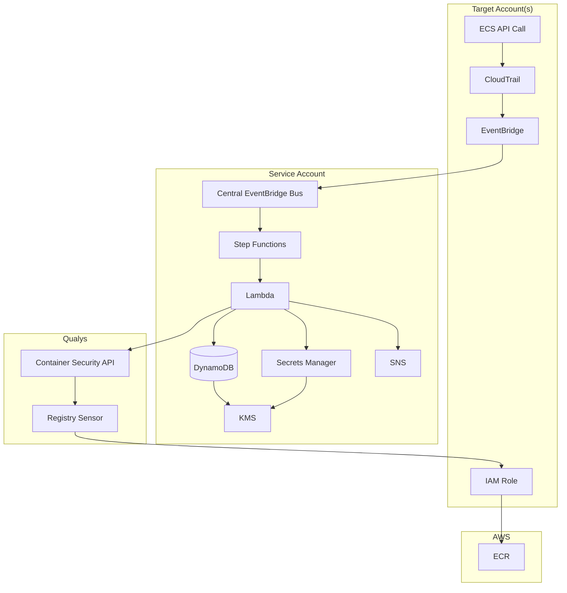
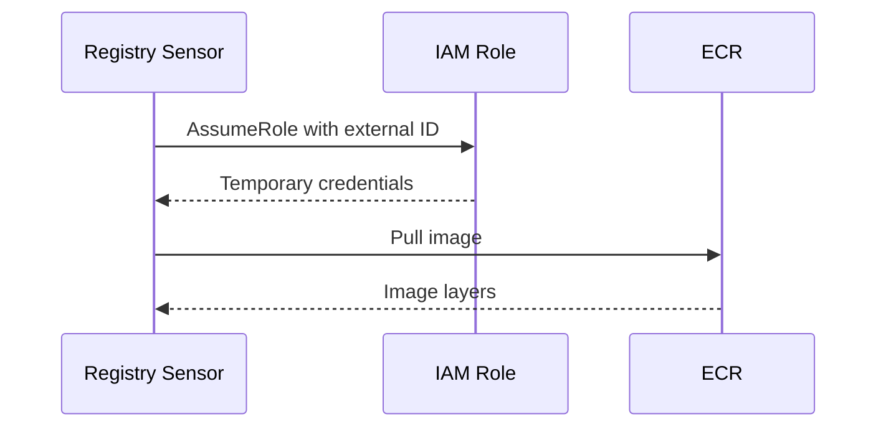
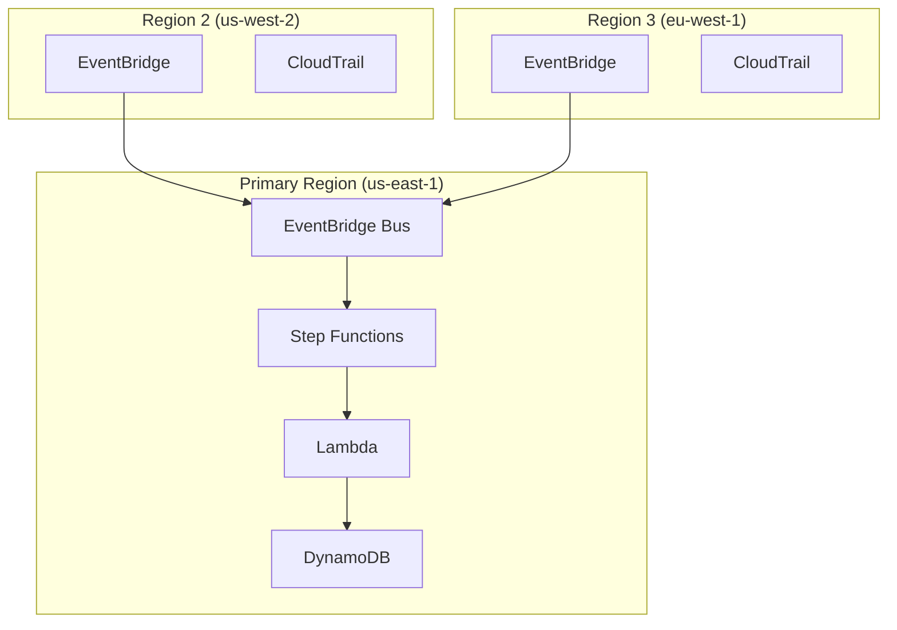
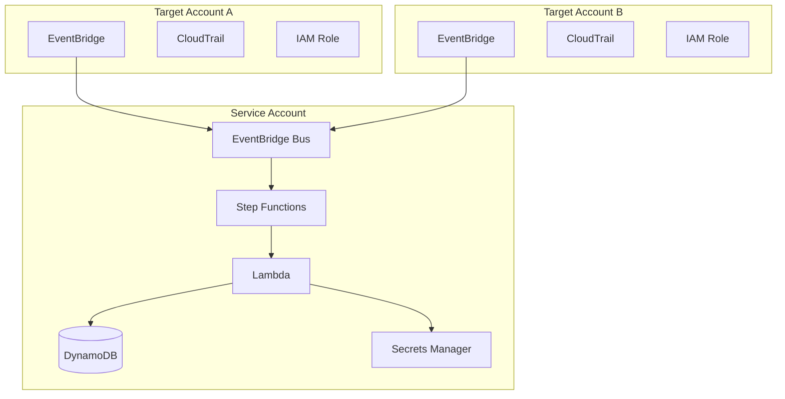
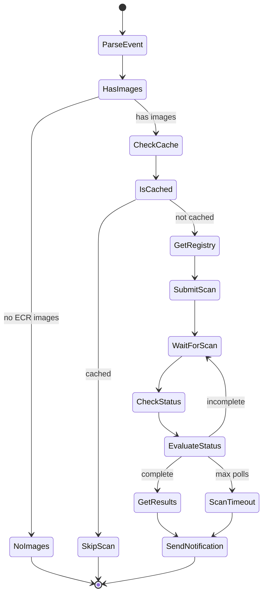

# Event-Driven Container Scanning for AWS Fargate

Automated vulnerability scanning for containerized workloads using Qualys Container Security, AWS Step Functions, and event-driven architecture.

## Overview

This solution automatically triggers vulnerability scans when ECS task definitions are registered or services deployed. It integrates with Qualys Container Security to scan ECR images and sends notifications for critical findings.

**Key capabilities:**
- Zero-touch scanning triggered by deployment events
- Multi-account support via service/target architecture
- Multi-region event forwarding
- 7-day scan caching (container images are immutable)
- KMS encryption for all data at rest
- CIS benchmark compliance

## Architecture

The solution uses two CloudFormation templates:

- **Service Account** (`service-account.yaml`): Central processing infrastructure including Lambda, Step Functions, DynamoDB, SNS, and Secrets Manager
- **Target Account** (`target-account.yaml`): Event capture and forwarding including CloudTrail, EventBridge rules, and IAM role for Qualys ECR access

For single-account deployments, both templates deploy to the same account.



## Security

### Encryption at Rest

All data is encrypted using customer-managed KMS keys with automatic annual rotation:

| Resource | Encryption | Additional Controls |
|----------|------------|---------------------|
| S3 (CloudTrail logs) | KMS with bucket keys | Versioning, access logging |
| S3 (Access logs) | AES-256 | Lifecycle expiration |
| DynamoDB | KMS | Point-in-time recovery, deletion protection |
| SNS | KMS | |
| Secrets Manager | KMS | |
| CloudTrail | KMS | Log file validation |
| CloudWatch Logs | KMS | 30-day retention |

### CIS Benchmark Compliance

| CIS Control | Implementation |
|-------------|----------------|
| S3 public access blocked | `PublicAccessBlockConfiguration` on all buckets |
| S3 HTTPS enforcement | `DenyInsecureTransport` bucket policy on all buckets |
| S3 versioning | Enabled on CloudTrail bucket |
| S3 access logging | Dedicated access logs bucket |
| KMS key rotation | `EnableKeyRotation: true` |
| CloudTrail log validation | `EnableLogFileValidation: true` |
| DynamoDB backup | Point-in-time recovery enabled |
| DynamoDB deletion protection | `DeletionProtectionEnabled: true` |

### IAM Least Privilege

Lambda execution roles use resource-scoped permissions:

| Permission | Resource Scope |
|------------|---------------|
| `secretsmanager:GetSecretValue` | Specific secret ARN |
| `dynamodb:GetItem`, `PutItem` | Specific table ARN |
| `sns:Publish` | Specific topic ARN |
| `kms:Decrypt`, `GenerateDataKey` | Specific KMS key ARN |
| `ecs:DescribeTaskDefinition` | Any (required for multi-account) |
| `sts:GetCallerIdentity` | Any (AWS limitation) |
| `xray:PutTraceSegments` | Any (AWS limitation) |

Step Functions and EventBridge roles are scoped to specific resource ARNs.

### Network Security

- S3 bucket policies enforce HTTPS (deny insecure transport)
- Public access blocked on all S3 buckets
- External ID protects against confused deputy attacks

## IAM Role Configuration

The Qualys Registry Sensor requires an IAM role to access ECR.

**Trust Policy:**
```json
{
  "Version": "2012-10-17",
  "Statement": [{
    "Effect": "Allow",
    "Principal": { "AWS": "arn:aws:iam::QUALYS_ACCOUNT_ID:root" },
    "Action": "sts:AssumeRole",
    "Condition": { "StringEquals": { "sts:ExternalId": "QUALYS_EXTERNAL_ID" } }
  }]
}
```

**Permissions:** `AmazonEC2ContainerRegistryReadOnly` managed policy

### Authentication Flow



Retrieve the Qualys account ID and external ID:
```bash
curl -s "https://gateway.qg2.apps.qualys.com/csapi/v1.3/registry/aws-base" \
  -H "Authorization: Bearer $TOKEN" | jq
```

## Deployment

### Single Account

Deploys both service and target stacks to the same account:

```bash
export QUALYS_API_TOKEN="your-token"

# Using existing role
make deploy QUALYS_POD=US2 EXISTING_ROLE_ARN=arn:aws:iam::123456789012:role/qualys-role

# Creating new role
make deploy QUALYS_POD=US2 CREATE_ROLE=true
```

### Multi-Region

Target stacks in secondary regions forward events to the primary region:



```bash
make deploy QUALYS_POD=US2 AWS_REGION=us-east-1 EXISTING_ROLE_ARN=...
make deploy-region REGION=us-west-2,eu-west-1 EXISTING_ROLE_NAME=qualys-role
```

### Multi-Account

Service/target pattern for AWS Organizations:



```bash
# Service account
make deploy-service QUALYS_POD=US2 OrganizationId=o-xxx EXISTING_ROLE_NAME=qualys-role

# Target accounts via StackSet
make deploy-target-stackset \
  OrganizationId=o-xxx \
  OrgUnitIds=ou-xxx \
  ServiceAccountId=111111111111 \
  CentralEventBusArn=arn:aws:events:... \
  EXISTING_ROLE_NAME=qualys-role
```

## Event Detection

CloudTrail captures ECS management events with log file validation:

```yaml
EventSelectors:
  - ReadWriteType: WriteOnly
    IncludeManagementEvents: true
EnableLogFileValidation: true
KMSKeyId: !Ref EncryptionKey
```

EventBridge matches the following events:

| Event | Description |
|-------|-------------|
| `RegisterTaskDefinition` | New task definition revision |
| `RunTask` | Standalone task launched |
| `CreateService` | New service created |
| `UpdateService` | Service deployment updated |

## Workflow



### Parse Event

Extracts ECR image URIs from task definition containers:

```python
ECR_PATTERN = r'^(\d+)\.dkr\.ecr\.([a-z0-9-]+)\.amazonaws\.com/([^:@]+)(?::([^@]+))?(?:@(sha256:[a-f0-9]+))?$'

def parse_ecr_image(image_uri):
    match = re.match(ECR_PATTERN, image_uri)
    if not match:
        return None
    account, region, repo, tag, digest = match.groups()
    return {
        'account_id': account,
        'region': region,
        'repository': repo,
        'tag': tag or 'latest',
        'digest': digest
    }
```

### Cache Check

DynamoDB stores scan results with 7-day TTL. Container images are immutable by digest:

```python
cache_key = data.get('digest') or f"{data['repository']}:{data['tag']}"
response = table.get_item(Key={'imageDigest': cache_key})
if 'Item' in response and response['Item']['ttl'] > now:
    return {'cached': True}
```

### Registry Management

Creates Qualys ECR registry connector if not found:

```python
def get_or_create_registry(creds, registry_name, account_id, region, role_arn):
    registry_uri = f"https://{account_id}.dkr.ecr.{region}.amazonaws.com"
    uuid = get_registry_uuid(creds, registry_uri)
    if uuid:
        return {'registry_uuid': uuid, 'created': False}
    result = create_ecr_registry(creds, registry_name, account_id, region, role_arn)
    return {'registry_uuid': result['registry_uuid'], 'created': True}
```

### Scan Submission

```python
payload = {
    "filters": [{"repoTags": [{"repo": repo_name, "tag": tag_filter}]}],
    "name": f"ECR-{repo_name}-{timestamp}",
    "onDemand": True,
    "forceScan": True,
    "registryType": "AWS"
}

response = requests.post(
    f"{gateway_url}/csapi/v1.3/registry/{registry_uuid}/schedule",
    json=payload,
    headers=headers
)
```

### Polling

Step Functions polls with configurable interval (default 60s) and max attempts (default 30):

```yaml
WaitForScan:
  Type: Wait
  SecondsPath: $.wait_seconds
  Next: CheckStatus

EvaluateStatus:
  Type: Choice
  Choices:
    - Variable: $.scan_complete
      BooleanEquals: true
      Next: GetResults
    - Variable: $.poll_count
      NumericGreaterThanEqualsPath: $.max_polls
      Next: ScanTimeout
  Default: IncrementPoll
```

### Notification

SNS notifications (KMS encrypted) sent for critical or high severity findings:

```python
summary = data.get('scan_result', {}).get('summary', {})
if summary.get('critical', 0) == 0 and summary.get('high', 0) == 0:
    return {'notified': False}

sns.publish(
    TopicArn=SNS_TOPIC_ARN,
    Subject=f"Scan: {repository} - {critical}C/{high}H",
    Message=json.dumps(result)
)
```

## API Reference

| Endpoint | Method | Purpose |
|----------|--------|---------|
| `/csapi/v1.3/registry/aws-base` | GET | Get Qualys account ID and external ID |
| `/csapi/v1.3/registry` | GET | Find registry by URI or name |
| `/csapi/v1.3/registry` | POST | Create ECR registry connector |
| `/csapi/v1.3/registry/{uuid}/schedule` | POST | Submit on-demand scan |
| `/csapi/v1.3/images/{imageId}` | GET | Check scan status |
| `/csapi/v1.3/images/{imageId}/vuln` | GET | Get vulnerability details |

## Cost Estimate

| Component | Cost |
|-----------|------|
| Step Functions | $0.025 / 1000 executions |
| Lambda | $0.20 / 1000 scans |
| DynamoDB | $0.25 / million requests |
| CloudTrail | $0.10 / 100k events |
| KMS | $1.00 / key/month |
| Cross-region events | $1.00 / million |

**Estimate:** $15-30/month for 1000 deployments per day.

## Troubleshooting

| Issue | Resolution |
|-------|------------|
| Workflow not triggering | Verify CloudTrail logs ECS events |
| Registry creation failed | Verify IAM role trust policy includes Qualys account |
| Scan timeout | Increase `MaxPollAttempts` parameter |
| API 401/403 errors | Regenerate Qualys token, update secret |
| Cross-account events not arriving | Verify EventBus policy allows target account |
